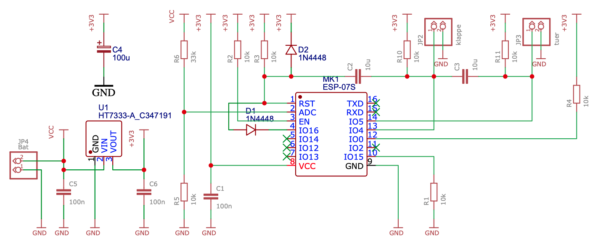

# WiFiMailbox 

Since I am older and live on the 2nd floor, I was tired of walking down and up the stairs all the time, even when there was no mail in the mailbox. That's why I got the idea for this project. An MQTT message is sent if either the flap or door on the mailbox is opened. When the flap is opened, a counter is incremented and "POST" is set to 1. If the door is opened, "POST" and "NUMBER" are reset to 0. The message is sent every hour. In between, the circuit goes into "DeepSleep" and is either woken up by the timer or by an action (flap/door). 
To update the software, the flap/door must be open so that it can be flushed using the OTA protocol. 

### MQTT message

- RAW raw data of the battery voltage (int: 0 - 1023) 
- AKKU battery voltage in volts (float: 0.0 - ...) 
- SIGNAL signal strength of the WiFi connection (int: -100 - 0) 
- KLAPPE State of the flap (char: '0'/'1') 
- TUER State of the door (char: '0'/'1') 
- POST is post there (char: '0'/'1') 
- ANZAHL Number of flap openings (int: 0 - ....) 

``` 
{"Raw": 794, "Akku": 3.34, "Signal": - 66, "Klappe": 0, "Tuer": 0, "Post ": 0," Anzahl ": 0} 
``` 

### Delivery

The circuit can be operated with 4xAA or 1xLiPo / LiFePo. When using a LiFePo, the components C4 / C5 / C6 and U1 are omitted. In addition, 2 solder pads (see [PCB](./res/pcb.png)) must be bridged. The switches (NC) are open when the mailbox is closed! If the flap/door is opened, the input of the ESP goes to ground and the reset input is also briefly connected to ground via the capacitor (s). This causes the ESP to wake up and send a corresponding MQTT message. 
The circuit was created with [EasyEDA](https://easyeda.com/Toni55/briefkastenmelder) and is stored in the "res" folder as a JSON file. 



## Component list 

    component   name  
    - 10uF      C3,C2 (KerKo)
    - 100nF     C1,C5,C6 (KerKo) 
    - 10kOhm    R2,R3,R4,R5,R1,R10,R11 
    - 33kOhm    R6 
    - flap      JP2 
    - door      JP3 
    - Bat       JP4 1X02 
    - 1N4148    D2,D1 
    - 100uF     C4 (ElKo) 
    - HT7333-A  U1 
    - ESP-07S   MK1 


## Software 

The software was compiled with [PlatformIO](https://platformio.org/) and the Arduinoframwork. 

## Libraries 

- Arduino.h 
- ArduinoOTA.h 
- ESP8266WiFi.h 
- **PubSubClient.h** 
- EEPROM.h 

## Authors 

* **Toni Reichartz** - *Initial work* 

## License

This project is licensed under the MIT License - see the [LICENSE.md](LICENSE.md) file for details